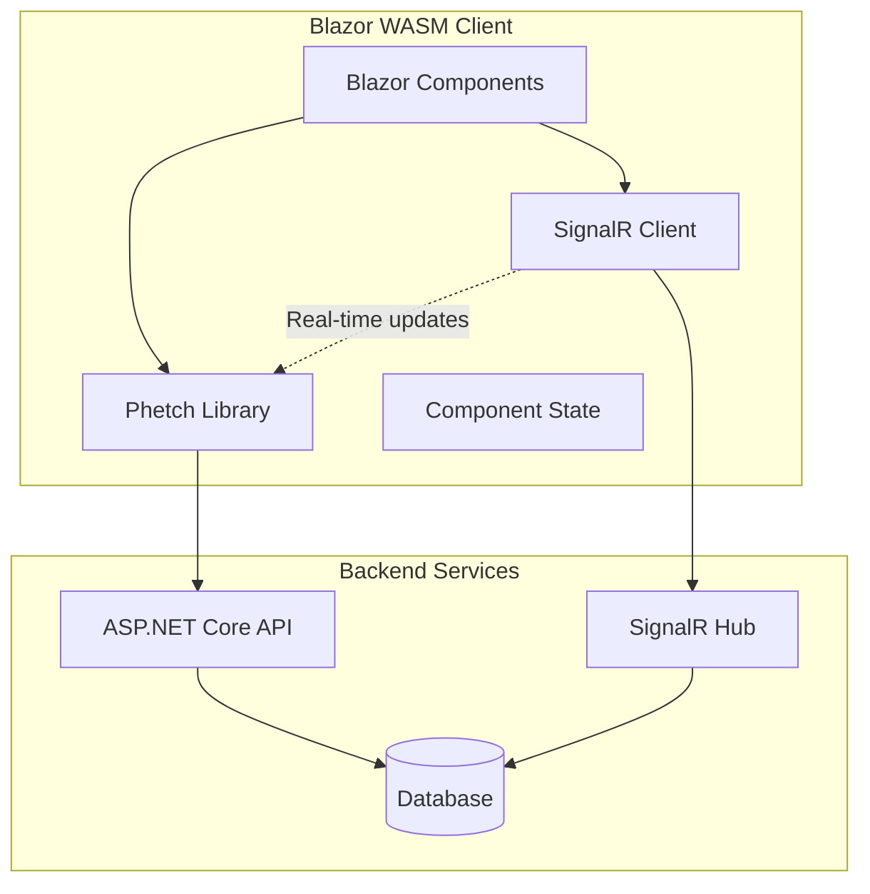

# Blazor WASM + Phetch Implementation Guide

## Architecture Overview

### Component Stack
- **Frontend:** Blazor WebAssembly (WASM) + Phetch library
- **State Management:** Phetch for server state + local component state
- **Real-time:** SignalR Blazor client
- **Styling:** Tailwind CSS integration
- **Build/Deploy:** Static assets via containers

### Phetch vs React Query Comparison

| Feature | React Query | Phetch |
|---------|-------------|---------|
| Caching | Automatic with keys | Automatic with endpoint arguments |
| Background refetch | Configurable intervals | `RefetchInterval` option |
| Optimistic updates | Manual cache updates | `UpdateQueryData` method |
| Error handling | Built-in retry logic | `RetryHandler.Simple` or Polly |
| Loading states | `isLoading`, `isFetching` | `IsLoading`, `IsFetching` |
| Invalidation | Query key based | Endpoint argument based |

## Implementation Architecture



## Phetch Integration Strategy

### Service Registration
```csharp
// Program.cs
builder.Services.AddScoped<HttpClient>();
builder.Services.AddScoped<ChatApiService>();
builder.Services.AddScoped<SignalRService>();
```

### API Service Definition
The ChatApiService encapsulates all Phetch endpoints:

```csharp
public class ChatApiService
{
    public Endpoint<string, UserProfile> GetUserProfile { get; }
    public Endpoint<int, List<ChatMessage>> GetChatHistory { get; }
    public Endpoint<(int chatId, int page), PaginatedMessages> GetChatPage { get; }
    public ResultlessEndpoint<ChatMessage> SendMessage { get; }
    public ResultlessEndpoint<int> DeleteMessage { get; }
    
    public ChatApiService(HttpClient httpClient, SignalRService signalR)
    {
        var defaultOptions = new EndpointOptions
        {
            CacheTime = TimeSpan.FromMinutes(5),
            StaleTime = TimeSpan.FromMinutes(1),
            RetryHandler = RetryHandler.Simple(2),
            OnSuccess = eventArgs => Console.WriteLine($"Query succeeded: {eventArgs}")
        };

        GetUserProfile = new(
            async (userId, ct) => await httpClient.GetFromJsonAsync<UserProfile>($"/api/users/{userId}", ct),
            options: defaultOptions
        );

        GetChatHistory = new(
            async (chatId, ct) => await httpClient.GetFromJsonAsync<List<ChatMessage>>($"/api/chats/{chatId}/messages", ct),
            options: new(defaultOptions) { StaleTime = TimeSpan.FromSeconds(30) }
        );

        GetChatPage = new(
            async (args, ct) => await httpClient.GetFromJsonAsync<PaginatedMessages>(
                $"/api/chats/{args.chatId}/messages?page={args.page}", ct),
            options: defaultOptions
        );

        SendMessage = new(
            async (message, ct) => 
            {
                await httpClient.PostAsJsonAsync("/api/messages", message, ct);
                // Invalidate chat history when message sent
                GetChatHistory.Invalidate(message.ChatId);
            },
            options: new(defaultOptions) 
            {
                OnSuccess = eventArgs => GetChatHistory.Invalidate(eventArgs.Arg.ChatId)
            }
        );

        DeleteMessage = new(
            async (messageId, ct) => await httpClient.DeleteAsync($"/api/messages/{messageId}", ct),
            options: defaultOptions
        );
    }
}
```

## Component Implementation Patterns

### Chat Message List Component
```razor
@inject ChatApiService Api
@inject SignalRService SignalR
@implements IDisposable

<div class="chat-container">
    <UseEndpoint Endpoint="Api.GetChatHistory" Arg="ChatId" Context="query">
        @if (query.IsLoading)
        {
            <div class="flex justify-center p-4">
                <div class="animate-spin rounded-full h-8 w-8 border-b-2 border-blue-500"></div>
            </div>
        }
        else if (query.IsError)
        {
            <div class="bg-red-100 border border-red-400 text-red-700 px-4 py-3 rounded">
                Error loading messages: @query.Error?.Message
            </div>
        }
        else if (query.HasData)
        {
            @if (query.IsFetching)
            {
                <div class="text-sm text-gray-500 text-center">Refreshing...</div>
            }
            
            @foreach (var message in query.Data)
            {
                <MessageComponent Message="message" OnDelete="HandleDeleteMessage" />
            }
        }
    </UseEndpoint>
</div>

@code {
    [Parameter] public int ChatId { get; set; }

    protected override async Task OnInitializedAsync()
    {
        // Setup SignalR real-time updates
        await SignalR.StartAsync();
        
        SignalR.OnMessageReceived += HandleNewMessage;
        SignalR.OnMessageDeleted += HandleMessageDeleted;
    }

    private void HandleNewMessage(ChatMessage newMessage)
    {
        if (newMessage.ChatId == ChatId)
        {
            // Update Phetch cache with new message
            Api.GetChatHistory.UpdateQueryData(ChatId, currentMessages => 
            {
                var updated = currentMessages.ToList();
                updated.Add(newMessage);
                return updated;
            });
        }
    }

    private void HandleMessageDeleted(int messageId, int chatId)
    {
        if (chatId == ChatId)
        {
            // Remove from Phetch cache
            Api.GetChatHistory.UpdateQueryData(ChatId, currentMessages => 
                currentMessages.Where(m => m.Id != messageId).ToList()
            );
        }
    }

    private async Task HandleDeleteMessage(int messageId)
    {
        var deleteQuery = Api.DeleteMessage.Use();
        await deleteQuery.TriggerAsync(messageId);
    }

    public void Dispose()
    {
        SignalR.OnMessageReceived -= HandleNewMessage;
        SignalR.OnMessageDeleted -= HandleMessageDeleted;
    }
}
```

### Message Input Component
```razor
@inject ChatApiService Api

<div class="border-t p-4">
    <div class="flex space-x-2">
        <input @bind="messageText" @onkeypress="HandleKeyPress" 
               class="flex-1 border rounded-lg px-3 py-2 focus:outline-none focus:ring-2 focus:ring-blue-500"
               placeholder="Type a message..." 
               disabled="@sendQuery.IsLoading" />
        
        <button @onclick="HandleSendMessage" 
                disabled="@(string.IsNullOrWhiteSpace(messageText) || sendQuery.IsLoading)"
                class="bg-blue-500 text-white px-4 py-2 rounded-lg hover:bg-blue-600 disabled:opacity-50">
            @if (sendQuery.IsLoading)
            {
                <span class="animate-spin inline-block w-4 h-4 border-2 border-white border-t-transparent rounded-full"></span>
            }
            else
            {
                <span>Send</span>
            }
        </button>
    </div>
    
    @if (sendQuery.IsError)
    {
        <div class="text-red-500 text-sm mt-2">
            Failed to send message: @sendQuery.Error?.Message
        </div>
    }
</div>

@code {
    [Parameter] public int ChatId { get; set; }
    
    private string messageText = "";
    private Query<ChatMessage> sendQuery = null!;

    protected override void OnInitialized()
    {
        sendQuery = Api.SendMessage.Use();
    }

    private async Task HandleSendMessage()
    {
        if (string.IsNullOrWhiteSpace(messageText)) return;

        var message = new ChatMessage
        {
            ChatId = ChatId,
            Content = messageText,
            Timestamp = DateTime.UtcNow
        };

        var textToSend = messageText;
        messageText = ""; // Clear immediately for UX

        try
        {
            await sendQuery.TriggerAsync(message);
        }
        catch
        {
            // Restore text on failure
            messageText = textToSend;
        }
    }

    private async Task HandleKeyPress(KeyboardEventArgs e)
    {
        if (e.Key == "Enter" && !e.ShiftKey)
        {
            await HandleSendMessage();
        }
    }

    public void Dispose() => sendQuery?.Dispose();
}
```

### Pagination Component with Prefetching
```razor
@inject ChatApiService Api

<UseEndpoint Endpoint="Api.GetChatPage" Arg="(ChatId, CurrentPage)" Context="query">
    @if (query.HasData)
    {
        @foreach (var message in query.Data.Messages)
        {
            <MessageComponent Message="message" />
        }
        
        <div class="flex justify-between items-center p-4">
            <button @onclick="PreviousPage" 
                    disabled="@(CurrentPage <= 1)"
                    class="bg-gray-300 px-3 py-1 rounded disabled:opacity-50">
                Previous
            </button>
            
            <span>Page @CurrentPage of @query.Data.TotalPages</span>
            
            <button @onclick="NextPage" 
                    disabled="@(CurrentPage >= query.Data.TotalPages)"
                    class="bg-gray-300 px-3 py-1 rounded disabled:opacity-50">
                Next
            </button>
        </div>
    }
</UseEndpoint>

@code {
    [Parameter] public int ChatId { get; set; }
    [Parameter] public int CurrentPage { get; set; } = 1;
    [Parameter] public EventCallback<int> CurrentPageChanged { get; set; }

    private void PreviousPage()
    {
        if (CurrentPage > 1)
        {
            CurrentPage--;
            CurrentPageChanged.InvokeAsync(CurrentPage);
            
            // Prefetch previous page
            if (CurrentPage > 1)
                Api.GetChatPage.Prefetch((ChatId, CurrentPage - 1));
        }
    }

    private void NextPage()
    {
        CurrentPage++;
        CurrentPageChanged.InvokeAsync(CurrentPage);
        
        // Prefetch next page
        Api.GetChatPage.Prefetch((ChatId, CurrentPage + 1));
    }
}
```

## SignalR Integration with Phetch

### SignalR Service
```csharp
public class SignalRService
{
    private readonly HubConnection hubConnection;
    public event Action<ChatMessage>? OnMessageReceived;
    public event Action<int, int>? OnMessageDeleted;

    public SignalRService(NavigationManager navigation)
    {
        hubConnection = new HubConnectionBuilder()
            .WithUrl(navigation.ToAbsoluteUri("/chathub"))
            .Build();

        hubConnection.On<ChatMessage>("MessageReceived", message => 
        {
            OnMessageReceived?.Invoke(message);
        });

        hubConnection.On<int, int>("MessageDeleted", (messageId, chatId) => 
        {
            OnMessageDeleted?.Invoke(messageId, chatId);
        });
    }

    public async Task StartAsync() => await hubConnection.StartAsync();
    public async Task StopAsync() => await hubConnection.StopAsync();
}
```

## Deployment Configuration

### Docker Container Setup
```dockerfile
FROM mcr.microsoft.com/dotnet/aspnet:9.0 AS base
WORKDIR /app
EXPOSE 80

FROM mcr.microsoft.com/dotnet/sdk:9.0 AS build
WORKDIR /src
COPY ["ChatApp.Client/ChatApp.Client.csproj", "ChatApp.Client/"]
RUN dotnet restore "ChatApp.Client/ChatApp.Client.csproj"
COPY . .
WORKDIR "/src/ChatApp.Client"
RUN dotnet build "ChatApp.Client.csproj" -c Release -o /app/build

FROM build AS publish
RUN dotnet publish "ChatApp.Client.csproj" -c Release -o /app/publish

FROM nginx:alpine AS final
COPY --from=publish /app/publish/wwwroot /usr/share/nginx/html
COPY nginx.conf /etc/nginx/nginx.conf
```

### Static Asset Optimization
```json
{
  "Tailwind": {
    "BuildPath": "./styles/app.css",
    "OutputPath": "./wwwroot/css/app.css"
  },
  "BlazorWasm": {
    "CompressionEnabled": true,
    "EnableAOT": true,
    "InvariantGlobalization": true
  }
}
```

## Performance Optimizations

### Phetch Configuration
```csharp
var optimizedOptions = new EndpointOptions
{
    StaleTime = TimeSpan.FromMinutes(5),    // Reduce background fetches
    CacheTime = TimeSpan.FromMinutes(10),   // Keep in memory longer
    RefetchOnFocus = false,                 // Disable focus refetch
    RefetchOnReconnect = true               // Refetch on network reconnect
};
```

### Bundle Optimization
- Enable AOT compilation for smaller bundle sizes
- Use tree-shaking to eliminate unused CSS
- Implement lazy loading for route components
- Preload critical chat data on app startup

## Error Handling Strategy

### Global Error Boundary
```razor
<ErrorBoundary>
    <ChildContent>
        @Body
    </ChildContent>
    <ErrorContent Context="error">
        <div class="error-container">
            <h3>Something went wrong</h3>
            <p>@error.Message</p>
            <button @onclick="RecoverError">Try Again</button>
        </div>
    </ErrorContent>
</ErrorBoundary>
```

### Phetch Error Recovery
```csharp
var resilientOptions = new EndpointOptions
{
    RetryHandler = RetryHandler.Simple(3),
    OnFailure = eventArgs => 
    {
        Console.WriteLine($"Query failed: {eventArgs.Exception.Message}");
        // Could trigger toast notification or logging
    }
};
```

## Key Benefits of Blazor + Phetch Approach

**Type Safety:** Full C# type system across frontend and backend
**Simplified State:** Phetch handles server state, local state stays simple  
**Real-time Integration:** SignalR naturally updates Phetch cache
**Familiar Patterns:** React Query patterns translated to C#
**Container Deployment:** Static assets deploy anywhere
**Performance:** AOT compilation + aggressive caching

**Confidence Score: 82%** - Strong architectural pattern with proven library support